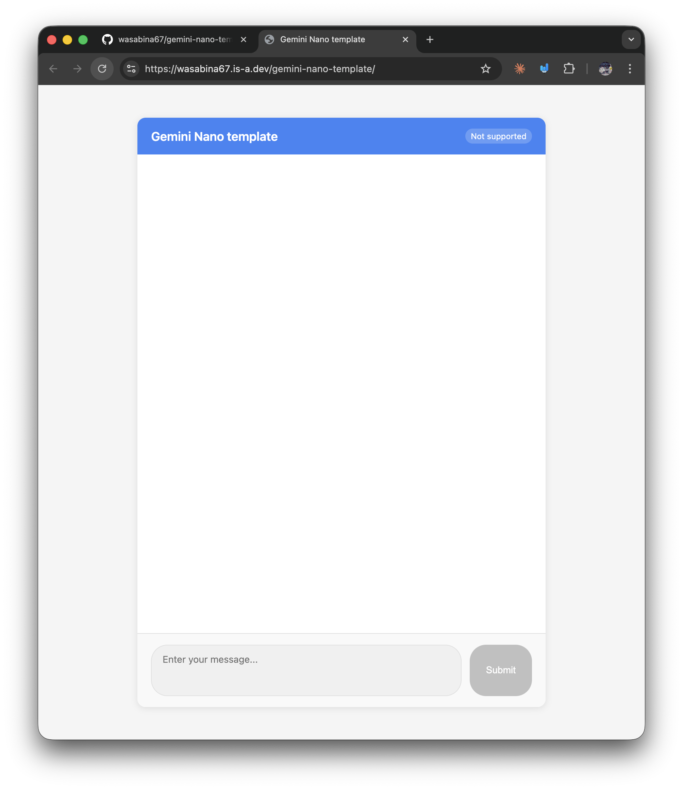
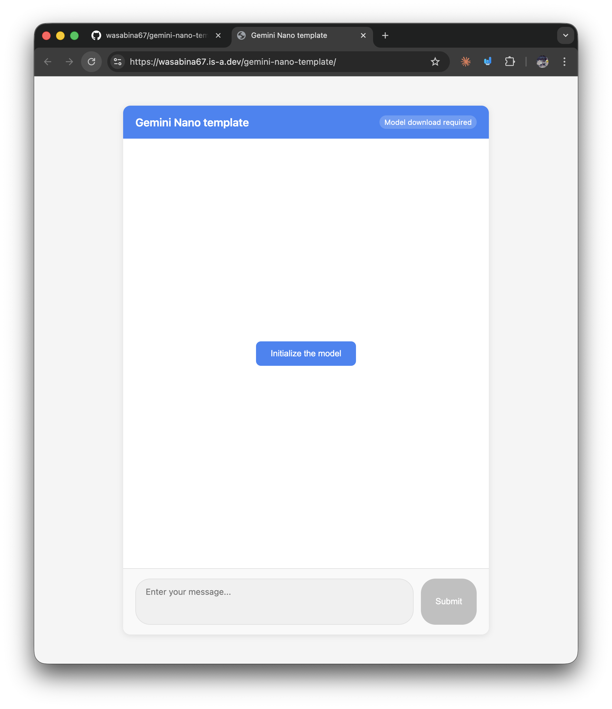

# is-this-a-no-problem
Is this a no problem?

## Setup


```
chrome://flags/#optimization-guide-on-device-model
```
-> Enabled

```
chrome://flags/#prompt-api-for-gemini-nano-multimodal-input
```
-> Enabled



## Install
```bash
npm i
```

## Run
```bash
node server.js
```
